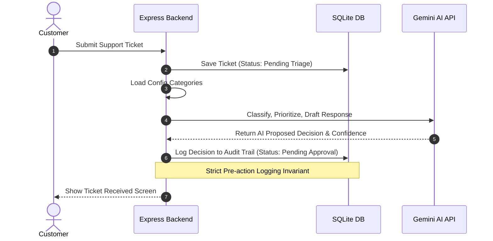

# Architecture Spine — Approval-Trail Ticket Triage

## Design Paradigm
The system implements a structured **Layered Architecture** with isolated **Port Adapters** for external boundaries. This separates web concerns (routing and controllers) from domain/application rules (services) and infrastructure boundaries (database adapters, Gemini client).

```
┌────────────────────────────────────────────────────────┐
│                        Web UI                          │
└───────────┬────────────────────────────────┬───────────┘
            │                                │
            ▼ (HTTP Routes)                  ▼ (HTTP Routes)
┌───────────────────────┐        ┌───────────────────────┐
│  Customer Controller  │        │   Agent Controller    │
└───────────┬───────────┘        └───────────┬───────────┘
            │                                │
            ▼ (Service Interface)            ▼ (Service Interface)
┌────────────────────────────────────────────────────────┐
│                     Triage Service                     │
└─────┬───────────────────┬───────────────────┬──────────┘
      │                   │                   │
      ▼ (Adapter Port)    ▼ (Adapter Port)    ▼ (Adapter Port)
┌───────────┐       ┌───────────┐       ┌───────────┐
│  Gemini   │       │ Database  │       │   Mock    │
│  Adapter  │       │  Adapter  │       │ Dispatch  │
└───────────┘       └───────────┘       └───────────┘
```

## Invariants & Rules

### AD-1 — Strict HITL (Human-in-the-Loop) Dispatch Constraint
- **Binds:** `all outbound communication / actions`
- **Prevents:** Automated email/response dispatch without manual human review and signed physical click event.
- **Rule:** The outbound dispatch system must explicitly reject any response sending instruction unless it is accompanied by an authorized Human Agent signature and a verification check against an existing database record marked `Approved`. No auto-send route can exist in the server.

### AD-2 — Config-Driven Ticket Classification Categories
- **Binds:** `Gemini Triage classifier prompt, Agent UI categories dropdown`
- **Prevents:** Hardcoded category lists in application source code.
- **Rule:** Allowed Ticket Categories must be resolved dynamically from an external configuration file (`config.toml` or `categories.json`) loaded at system startup. The app must crash immediately at startup if the configuration file is missing, empty, or fails syntax validation.

### AD-3 — AI Pre-action Decision Logging
- **Binds:** `Gemini API invocation lifecycle`
- **Prevents:** Returning AI suggestions to route handlers or client dashboards before those suggestions are securely committed to the Audit Trail.
- **Rule:** The Triage Service must complete a successful database write to the Audit Trail table, recording Gemini's proposed category, priority, confidence scores, and raw response draft, with status `Pending Approval` *before* the dashboard or queue controllers can access or display the recommendations.

### AD-4 — Database-Level Immutable Audit Trail
- **Binds:** `Audit Trail data layer`
- **Prevents:** Support agents, administrators, or auditors from modifying or wiping historical audit logs.
- **Rule:** The database schema must enforce write-only (append-only) constraints on the `audit_trail` table. The DB schema must use database-level triggers to fail any query containing an `UPDATE` or `DELETE` statement targeting the `audit_trail` table.



## Consistency Conventions

| Concern | Convention |
| --- | --- |
| Naming | Files: `kebab-case` (e.g. `triage-service.js`). Classes/Constructors: `PascalCase`. Variables/Functions: `camelCase`. DB Tables: `snake_case`. |
| Data & formats | Identifiers: `UUIDv4` for tickets. Incremental IDs for Audit Log entries. Timestamps: ISO 8601 UTC string formats (YYYY-MM-DDTHH:mm:ssZ). |
| State & cross-cutting | Configuration: Loaded at startup into an immutable global store. State mutation: Done through atomic SQL transactions. Logging: All server actions write structured JSON to standard output. |

## Stack

| Name | Version |
| --- | --- |
| Node.js | v18+ |
| Express.js | v5.2.x |
| @google/generative-ai | v0.24.x |
| SQLite | sqlite3 or better-sqlite3 |
| Jest | v30.x |

## Structural Seed

```text
{root}/
  package.json
  server/
    config/          # Server configuration files (categories.json)
    db/              # SQLite DB schema and migrations
    routes/          # Express route definitions (tickets, audit, admin)
    controllers/     # Request handlers mapping to services
    services/        # Pure domain logic (triage logic, verification rules)
    adapters/        # Client connectors (Gemini client, Mock email dispatcher)
  __tests__/         # Backend Jest integration tests
```

### Database Schema Seed
```sql
CREATE TABLE tickets (
    id TEXT PRIMARY KEY, -- UUIDv4
    email TEXT NOT NULL,
    name TEXT NOT NULL,
    subject TEXT NOT NULL,
    description TEXT NOT NULL,
    status TEXT NOT NULL CHECK (status IN ('Pending Triage', 'Pending Approval', 'Resolved')),
    created_at TEXT NOT NULL
);

CREATE TABLE audit_trail (
    id INTEGER PRIMARY KEY AUTOINCREMENT,
    timestamp TEXT NOT NULL,
    ticket_id TEXT NOT NULL,
    action_type TEXT NOT NULL CHECK (action_type IN ('AI_TRIAGE', 'HUMAN_APPROVAL', 'HUMAN_OVERRIDE')),
    decision TEXT NOT NULL, -- JSON containing category, priority, draft response
    confidence REAL, -- Gemini confidence score
    status TEXT NOT NULL,
    FOREIGN KEY(ticket_id) REFERENCES tickets(id)
);

-- Trigger to enforce Immutable Audit Trail (AD-4)
CREATE TRIGGER block_audit_updates
BEFORE UPDATE ON audit_trail
BEGIN
    SELECT RAISE(FAIL, 'Updates are forbidden on audit_trail table');
END;

CREATE TRIGGER block_audit_deletes
BEFORE DELETE ON audit_trail
BEGIN
    SELECT RAISE(FAIL, 'Deletes are forbidden on audit_trail table');
END;
```

## Capability → Architecture Map

| Capability / Area | Lives in | Governed by |
| --- | --- | --- |
| Ticket Submission (FR-1) | `server/routes/` & `server/controllers/` | Layered Architecture |
| Dynamic Triage Config (FR-2) | `server/config/` & `server/services/` | AD-2 (Config-driven Categories) |
| AI Triage Generation (FR-3) | `server/services/` & `server/adapters/` | AD-3 (Pre-action Log) |
| Pre-Action Auditing (FR-4) | `server/db/` & `server/services/` | AD-3 & AD-4 (Immutable Logs) |
| Queue Dashboard (FR-5) | `server/controllers/` | Layered Architecture |
| HITL Approval (FR-6, FR-7) | `server/controllers/` & `server/services/` | AD-1 (Strict HITL) |
| Immutable Log Feed (FR-8) | `server/db/` | AD-4 (Immutable Logs) |

## Deferred
1. **Outbound SMTP Dispatch Provider:** Since MVP is mock dispatch, actual email transport implementation (SES vs Sendgrid) is deferred.
2. **Support Agent Authentication Protocol:** Details of SSO/OAuth authentication layers are deferred to Phase 2.
3. **Frontend Framework Selection:** Whether the Web client is written in pure vanilla HTML/JS or React/Vue is deferred, as the backend Express JSON APIs are completely decoupled.
